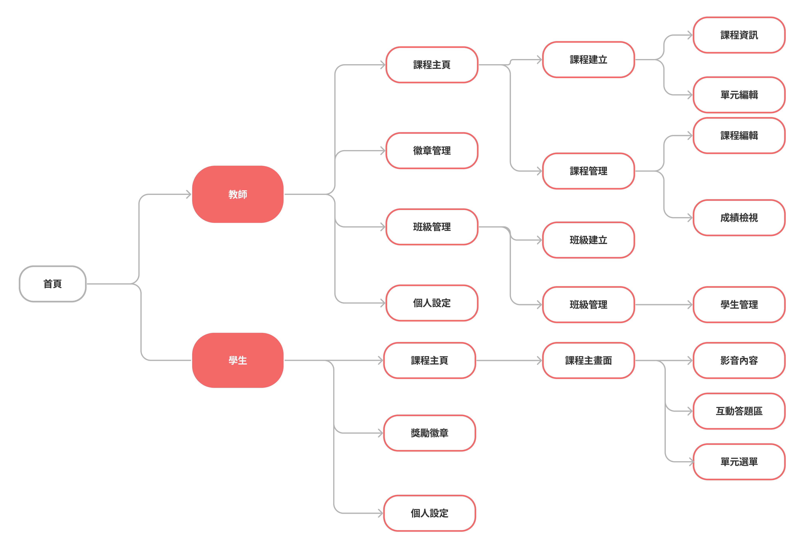

  

 

  

    <a href="https://www.linkedin.com/in/amber-liang-b935a1136/">About Me</a>
    |
    <a href="https://lesson-plan-creator.web.app/">EduTube</a>
    |
    <a href="https://youtu.be/BENZstmD930">Demo</a>
  

# EduTube

[EduTube](https://lesson-plan-creator.web.app/) is an interactive video lesson platform for teachers to insert questions at specific timestamps in YouTube videos, featuring a competitive game mode and badge collection to activate students' motivation.

## About

- Applied `React / React Router` for SPA, utilizing `useContext` for **global state management**.
- Applied `Styled-Components` to write CSS in JS efficiently.
- Designed `Firestore` data structures for managing course data and student information through **CRUD operations**.
- Incorporated image upload features through `Firebase Storage`.
- Leveraged `Firebase-admin functions` deployed to `Cloud Functions`, **teachers can create student accounts** by triggering the function.
- Controlled **video playback behavior** using the `YouTube IFrame Player API`, such as player controls, video playback functionality, pause functionality.
- Created **user tours** using the `react-joy-ride library`.
- Allowed teachers to upload and edit student data through **excel file** using the `react-excel-renderer library`.
- **Visualized student performance** data using the `Chart.js library`.

## Built with

   

**Libraries**

- react-joy-ride library
- react-excel-renderer library
- react-icons
- sweetalert2

### Flow chart

### Demo

1. Homepage animations and introductory videos enhance user experience.  
   
2. Student interface's game mode rewards correct answers with badges.
   
3. Teacher interface has a course creation feature with three question types to choose from.
   
4. Teachers can view student performance data through a dedicated section with chart options in their interface.
   
5. Teacher interface allows class creation, with options to manually add students or upload a list from Excel. Student accounts are created and managed by teachers; thus unregistered students automatically get an account.  
   
6. Teacher interface has a badge redemption feature; students without badges can't redeem.
   
